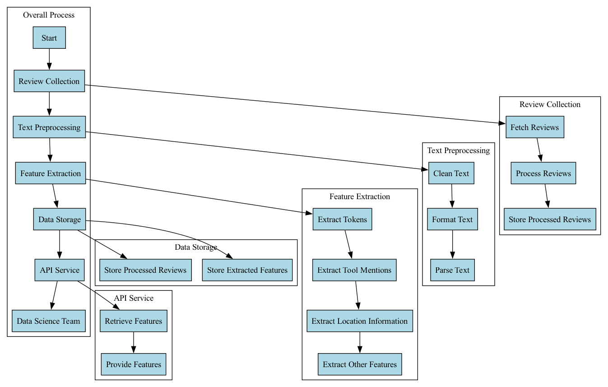

# Automated Review Processing System

This repository contains the documentation, flow charts & code used to create flow charts for an automated review processing system designed to collect, process, and extract features from B2B software reviews.

## Overview

The system receives thousands of B2B software reviews on a weekly basis from various sources. These reviews undergo a moderation process to ensure quality and authenticity before being processed for feature extraction. The extracted features are stored for downstream analysis by the data science and analytics team.

## Architecture

The system architecture consists of the following components:

- **Review Collection**: Fetch reviews from sources & load it to s3 bucket(or equivalent FS).
- **Text Preprocessing**: Cleans and formats the text data for further processing.
- **Feature Extraction**: Extracts features such as tokens, tool mentions, and location information from the reviews.
- **Data Storage**: Stores the processed reviews and extracted features in a database.
- **API Service**: Provides an interface for accessing the extracted features with minimal latency.
- **Data Science Team**: Utilizes the API service to access the extracted features for downstream analysis.

## Technologies Used

- **NLTK (Natural Language Toolkit)**: For text preprocessing tasks such as tokenization and stop words removal.(We can get into better sophisticated toolkits but for starters, this should be good)
- **Apache Spark**: Distributed computing framework for scalable feature extraction.
- **Spark NLP**: Natural Language Processing library for Apache Spark.
- **MongoDB**: NoSQL database for storing processed reviews and extracted features.
- **Elasticsearch**: Distributed search and analytics engine for storing and querying textual data.
- **Airflow**: Will serve as our Orchestration/Automation tool .
- **FastAPI**: Web framework for building high-performance APIs with Python.
- **Jupyter Notebooks**: Interactive computing environments for data analysis and visualization. (Given Data Scientists/Business Analysts would need a simple interface to work with)

## Final Architecture Diagram

